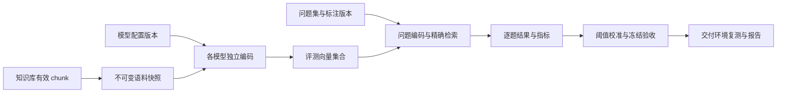

# 向量模型评测与交付验证方案

日期：2026-09-04

状态：已完成首版实现与本地功能验证，详见[实施验证记录](../verification/2026-09-04-embedding-evaluation.md)。用户提供的 0.56 / 0.54 是问题线索，不是本次合成样本实测结果。

## 1. 目标与判断原则

用户发现：一个包含原问题的 chunk 排名第一，相似度约 0.56；第二个没有直接相关内容的 chunk 约 0.54。需要便捷复现问题、比较本地 embedding 模型，并形成生产交付可复核的数据。

产品目标是回答四个问题：

1. 正确内容能否被找到，并排在前面？
2. 遇到相近主题、不同条件的内容时，是否容易排错？
3. 同一个意图换一种问法，正确内容是否仍能被找到？
4. 知识库没有答案时，是否仍返回看似可信的无关内容？

0.56 不是“56% 正确率”。0.02 的差值值得记录，但单次差值不能证明排名不稳定，也不能推出模型不可用。正式选型依据排名、人工相关性、查询变体、无答案样本和运行表现；相似度及差值用于解释个案。

## 2. 当前项目事实与优先排查项

### 2.1 已核对的代码

- [application.yml](../../../server/Spring-AI/src/main/resources/application.yml) 配置 `quentinz/bge-base-zh-v1.5:latest`，向量库维度为 768。
- [ChunkIndexContentBuilder](../../../server/Spring-AI/src/main/java/com/starsea/ai/chunking/context/ChunkIndexContentBuilder.java) 实际拼接标题路径、可选上文和正文作为 `indexContent`。
- [SpringAiChunkVectorGateway](../../../server/Spring-AI/src/main/java/com/starsea/ai/chunking/indexing/SpringAiChunkVectorGateway.java) 把 `indexContent` 写入同一个 `VectorStore`；向量元数据目前没有模型 digest 或编码配置版本。
- [PgVectorRagServiceImpl](../../../server/Spring-AI/src/main/java/com/starsea/ai/service/impl/PgVectorRagServiceImpl.java) 共用一个 `VectorStore`，按租户、知识库和启用文件过滤；请求最多过量获取 3 倍候选，再校验有效 chunk、去重、取 Top K。
- 该服务将返回分数限制到 `[0,1]`。这个限制不会改变 0.56 和 0.54，但会抹去负余弦值，评测应保留原始分数。
- 项目 Spring AI 版本为 `1.0.0-M6`。本地对应版本源码中，Ollama 的 `embed(Document)` 使用文档文本，PgVector 在余弦距离模式下将分数计算为 `1 - distance`。生产环境是否存在配置覆盖，仍需运行时核对。

### 2.2 对这个问题的诊断流程

| 检查 | 方法 | 能说明什么 |
| --- | --- | --- |
| 自相似检查 | 同一完整字符串、同一模型版本、同一编码角色及参数，独立编码两次并计算余弦 | 正常应接近 1；显著偏离时优先排查链路。查询角色与文档角色输入不同的测试不套用这一预期 |
| 入模文本 | 展示原问题、chunk 正文、最终完整入模文本及内容哈希 | “chunk 包含问题”不等于两端输入完全相同 |
| 文本长度 | 关闭静默截断，保留模型返回的超长错误 | 排查答案是否落在被截断部分；不同模型不能直接共用一个 tokenizer 的计数保证 |
| 编码方式 | 检查 query/document 前缀、模型 tag、digest、量化及运行参数 | 避免把编码配置差异误认成纯模型差异 |
| 新旧向量一致性 | 用当前模型重新计算原问题与原 chunk 的得分，再与存量检索记录比较 | 历史向量没有模型版本元数据时，只能标记来源未确认，不能宣称兼容 |
| 计分含义 | 保存距离类型、原始距离、原始相似度和展示精度 | 排除距离当相似度、取整、范围转换等问题 |

BGE 官方对相似度分布、基于业务数据确定阈值，以及检索查询前缀有专门说明。是否加前缀应作为可记录的配置实验；不能直接认定“未加前缀”就是这次问题的原因。[BGE 模型说明](https://huggingface.co/BAAI/bge-base-zh-v1.5)

当前 Ollama 模型页面标注 512 的上下文窗口，应核对本地实际模型版本；Ollama `/api/embed` 支持 `truncate: false`，超长时返回错误。[当前模型](https://ollama.com/quentinz/bge-base-zh-v1.5)、[embedding 接口](https://docs.ollama.com/api/embed)

本次没有获取用户实际问题、完整 chunk、运行时环境和历史向量，因此没有完成上述问题的根因诊断。

## 3. 方案选择与首版范围

| 方案 | 用户成本 | 得到的证据 | 用途 |
| --- | --- | --- | --- |
| 单块相似度 | 输入问题、选模型 | 一对文本的分数、输入及配置检查 | 保留为诊断入口 |
| 目标块加干扰块 | 多确认几个候选的相关性 | 固定候选范围内的排序、困难负例区分 | 快速复现和积累样本 |
| 固定语料加问题集 | 冻结语料、审核问题和相关性 | 全范围检索表现、阈值及交付报告 | 正式模型选型与验收 |

建议三种方式共用模型配置、问题和结果结构。前两种是同一个产品的快捷入口，第三种产生正式评测报告。

首版采用本地 Ollama、固定 chunk 快照、精确余弦检索，支持 2～3 个候选模型或编码配置。模型单独生成全部快照向量，维度可以不同。评测计算与线上知识库索引隔离。

首版必须包含：模型配置、单问题复现、人工标注与问题集、批量评测、阈值校准、结果留存与导出。自动生成测试题、LLM 裁判、自动切换线上模型留到后续；人工审核是首版真值来源。

## 4. 多模型配置与现有配置兼容

### 4.1 页面

在现有“模型”页面增加“对话模型 / 向量模型”标签。向量模型使用简单列表，不增加厂商树。

基本字段为显示名称、Ollama 服务地址、完整模型名及 tag。无需 API Key；服务地址指后端能访问的地址。验证时确认 embedding 能力并读取实际维度。

高级设置折叠 query 前缀、document 前缀及必要运行选项，默认保持该条配置明确指定的行为。自动识别的建议必须可查看，不能在运行中静默改变。当前配置的首次基线保持现有编码行为；“相同 BGE 加查询前缀”可作为另一条候选配置。

列表显示维度、可用状态、来源和最近验证时间。配置变更生成新版本，历史结果仍引用旧版本。

### 4.2 配置文件兼容

将当前运行配置暴露为只读候选，标记“当前知识库配置”。页面新增配置按租户持久化，可编辑和删除；已有运行记录继续保留配置快照。

首次评测使用当前配置重算向量，报告名称为“当前配置重算基线”。历史生产索引的结果单列为“生产存量检索”，直到核实建库模型版本及文本版本，不将两者混为同一实验。

运行记录保存完整模型标识、可取得的 digest、Ollama 版本、量化、维度、编码配置和时间。正式验收需要可识别的模型版本，不能只记录可移动的 `latest` 标签；运行前后检查版本是否一致。

## 5. 评测数据：让问题从日常操作中积累

### 5.1 从当前问题开始

从 chunk 卡片或检索结果点击“加入评测”，自动带入问题（若有）、来源和 chunk。用户确认它是否能够回答该问题，并从同题检索结果中挑选容易混淆的 chunk。

针对 0.56 / 0.54 的案例，首先保存原问题、两个 chunk 的完整快照和人工标签。再补充 2～3 个经人工确认语义相同的问法，例如口语问法、同义改写、省略非必要修饰。原问题保持为基线样本。

### 5.2 样本结构

一个问题记录：文本、所属意图组、业务类别、来源、是否可回答、样本分组和人工审核状态。每个“问题 × chunk 快照”单独存相关性：

- `2`：内容足以支持该问题的答案。
- `1`：有相关信息，但不足以支持答案。
- `0`：无关，或因实体、时间、条件等不匹配而不能支持答案。
- 未标注：未知，不能自动当作 `0`。

困难负例是“看起来很像但不能支持答案”的已审核 `0` 标签；第二名只是不含原问题字面内容时，仍需要阅读确认，不能直接当负例。

首版正式指标优先覆盖可由单个 chunk 支持答案的问题；跨块联合证据问题标为单独类别，不混入要求单块完整回答的指标。若多个 chunk 都能回答，则都可标 `2`。

“知识库无答案”由熟悉业务的人对指定快照确认，不能依据当前模型没有检索到答案自动生成。

### 5.3 语料与标注覆盖

快速对比可以使用手选的小候选集，但界面和报告必须标记“候选集内对比”。正式评测使用指定知识库的全部有效 chunk 快照，或用户明确选择的文档范围，始终显示实际文档数和 chunk 数。

各模型 Top K 的并集进入统一标注池，并补入人工已知答案及关键词检索找到的候选，减少仅标当前模型返回内容的偏差。每个模型使用同一版本真值。重复标注时可隐藏模型名与分数，降低主观影响。

正式报告要求审核全部入选模型用于计分的 Top K 候选，并审核已知答案；存在未知标签时，报告标为“标注未完成”。相关 chunk 未穷尽时不能声称完整 Recall，即使 Top K 都已审核。nDCG 的理想排序基于已冻结的已知标签集合，不能把标注池外的潜在相关内容描述成已排除。

标注变化生成新版本，所有模型统一重算指标；旧报告保持其原始版本。

### 5.4 数据量与防止过拟合

先积累约 30 个真实意图用于探索和完善流程；交付前可从 100～300 个真实意图起步，按业务复杂度继续增加。这些数量是启动建议，不是质量保证门槛。

至少覆盖原句、同义问法、主题相似但条件不同、实体或编号、较长 chunk，以及无答案问题。相似问法都属于同一个意图组，不当作完全独立的证据。

按意图组划分“调试/校准集”和“冻结验收集”，同义变体及近重复问题不得跨组泄漏。先使用校准集选模型配置和阈值，再运行验收集。看过验收结果后继续调参的版本，需要用新的保留样本验收。

## 6. 指标：排名为主，差值辅助解释

所有排名指标先在无分数阈值的精确检索结果上计算，再单独评估阈值策略。保留原始余弦的 `[-1,1]` 范围。排序使用完整精度；界面显示四位小数，不用显示值重新排序。

运行至少保存各指标所需最大 K 的完整候选（首版 MRR@10 因而至少保存 Top 10），并审核对应并集。界面默认展示 5 条不改变后台计分范围。小候选集不足该数量时明确显示实际范围，不能直接与全库结果比较。

| 指标 | 首版口径 | 回答的问题 |
| --- | --- | --- |
| Hit@1 / Hit@5 | 可回答问题中，前 1 / 5 条至少包含一个 `2` 标签的比例 | 能否找到可用于回答的证据 |
| MRR@10 | 第一个 `2` 标签排名的倒数；前 10 未命中计 0，再按问题平均 | 正确内容是否足够靠前 |
| nDCG@5 | 使用 0/1/2 相关性，增益为 `2^label - 1`，基于冻结标注版本 | 多条结果整体排序是否合理 |
| 困难负例胜出率 | 每题最高分 `2` 标签是否严格高于最高分指定困难负例；按题平均 | 是否把可回答内容排在容易混淆的内容之前 |
| 变体组全部命中率 | 每个意图组的原句与已审核变体，是否全部 Hit@K | 换种问法是否仍能召回 |
| 无答案误召回率 | 已确认无答案的问题中，应用阈值后仍返回至少一条结果的比例 | 是否把无关内容交给下游 |
| 有答案正确证据保留率 | 可回答问题中，应用阈值后仍至少保留一条 `2` 标签的比例 | 提高阈值是否误伤正确证据 |
| 延迟与失败率 | 预热后查询编码加检索的 p50/p95；冷加载、建库耗时、失败数单列 | 性能能否满足交付条件 |

MRR、nDCG 和 Recall 等是通用检索评测指标。此方案中的相关性等级、命中口径和适用样本范围是本产品的明确约定。[Sentence Transformers 检索评测说明](https://www.sbert.net/docs/package_reference/sentence_transformer/evaluation.html#informationretrievalevaluator)

二元指标只将 `2` 视为完整证据；`1` 在 nDCG 中获得部分权重。无答案问题从需要正例的排名指标分母中分离。Recall@K 只在相关 chunk 标注足够完整时启用，明确标注基于哪一版真值。

### 6.1 专门解释 0.56 / 0.54 的视图

显示“最佳可回答块分数”“最高已确认无关块分数”和两者差值：

`gap(q, model) = max(score of label 2) - max(score of reviewed label 0)`

这个案例在标签确认后得到约 `+0.02`，描述为“正确块领先已标注无关块 0.02”。如果第二条也有相关信息，它不能充当这里的无关块。任意一类缺失时显示“缺少标注”，不能补零。

差值只相对于已审核范围成立，注明“已标注候选范围”。对固定的已标注正例和负例额外计算分数，即使它们没有进入 Top K；不能把未返回当作 0 分。不使用跨模型统一的差值门槛，也不按平均 gap 排模型总榜。针对一个模型，把 gap 较小、正例掉出 Top K 和困难负例反超的样本集中起来复核。

同分用固定 chunk ID 排序保证可复现，同时记录同分；困难负例胜出率遇同分视为未严格胜出。展示“同分候选”而不是把确定性排序规则解释为模型判断。

### 6.2 如何验证稳定性

使用真实用户问法和人工确认变体，记录目标 chunk 的排名变化、每个变体的 Hit@K，以及困难负例是否反超。重复执行完全相同的查询用于运行一致性检查，不能替代语言变体测试。

报告同时提供按问题的指标和按意图组汇总的指标，避免某个意图拥有大量改写后主导平均数。正式模型差异可按意图组做配对 bootstrap 区间；若区间跨过零，记录“提升证据不足”，不宣布候选必然更优。

## 7. 阈值校准与生产验收

每个模型配置独立选择阈值。不得从单个 0.56 / 0.54 样本推断统一阈值为 0.55，也不得直接复用旧模型的阈值。

校准页针对某一模型显示阈值变化下的“正确证据保留率 / 无答案误召回率 / 有答案但返回空的比例”。先确定业务允许的误召回和漏召回水平，再在校准集上选阈值，固定后到验收集复测。

固定 Top K 及阈值边界规则。当前 PgVector SQL 的严格距离比较对应 `score > threshold`，当前链路复现采用这一规则；新增策略若使用包含等号的比较，必须作为参数记录并在交付链路保持一致。模型基准的“关闭阈值”表示完全不做分数过滤，不是把阈值设为 0。

无答案误召回只描述检索层：返回了候选不等于最终一定生成错误答案。生成回答的正确率需要后续独立端到端验收。

### 7.1 两次验证

1. **模型验证**：同一语料快照、精确检索、统一 Top K，各模型按记录的编码规则独立生成向量；用于选模型及编码配置。
2. **交付验证**：使用目标部署环境和候选模型的独立索引，复跑冻结验收集；启用生产计划使用的 ANN 参数、权限过滤、候选截断及阈值。把精确检索与交付检索的差异单列，定位索引或链路损失。

重排或混合检索若属于交付方案，应另存一组“完整链路”结果，保留纯向量基线，避免把链路变化归功于 embedding 模型。

### 7.2 验收协议与报告状态

协议在正式验收前记录：业务范围、冻结数据集版本、各类型最小样本要求、关键问题列表、Hit@K 下限、无答案误召回上限、正确证据保留率下限、p95 预算和部署环境。数值由业务交付目标确定，不预设一个适用于所有项目的统一标准。

报告状态为“满足已设门槛 / 不满足 / 证据不足”。以下情况不能出具通过结论：未填写验收要求、关键类型没有样本、Top K 标注不完整、向量快照不完整、模型版本变化、运行失败未处理，或只做了候选小集合测试。

候选模型对当前基线的退化问题逐条列出。关键业务问题应逐条审核，不用整体均值掩盖退化。模型是否“优于基线”和是否“达到交付要求”分别判断。

## 8. UI 设计

沿用项目色彩：深蓝 `#11243B`、浅蓝 `#EAF1F5`、纸白 `#FCFDFC`、青绿 `#00A6A6`、灰蓝 `#64748B`。正文使用现有 Noto Sans SC，页面标题沿用 Noto Serif SC，分数与 ID 使用 JetBrains Mono。

### 8.1 入口与页面关系

- 模型页：“向量模型”标签维护候选配置。
- chunk 卡片：“相似度测试 / 加入评测”打开右侧抽屉，复现问题或创建样本。
- 知识库详情：“检索评测”作为新标签，内部提供“快速对比 / 问题集 / 运行记录”。不增加一个脱离知识库的复杂一级系统。

### 8.2 快速对比

```text
检索评测 · 产品使用手册
[快速对比] [问题集] [运行记录]

语料：全部有效分块 · 快照 v3 · 1,240 块
模型：[当前配置] [候选 B] [+ 选择模型]
问题：[原问题或真实用户问法…………………………] [开始对比]

[按排名查看] [按相同 chunk 对齐]
Chunk / 内容                     当前配置             候选 B
C12 · 能直接支持答案             #1 · 0.5600          等待计算
C38 · 主题相近但条件不符         #2 · 0.5400          等待计算

点击内容：[完整入模文本] [来源] [相关性标注]
[加入问题集] [添加同义问法]
```

上方数字为用户案例和布局示意，并非已完成评测。实际分数旁显示相关性标签、来源、名次及入模文本；不按跨模型分数高低判胜负。

在 chunk 抽屉中允许“仅当前块 / 当前块及干扰块”；切到全部语料评测时复用同一问题。小候选集的局限以范围标签持续可见。

### 8.3 批量报告

报告顶部显示问题集版本、语料快照、实际完成数量和可用性状态。主体使用对比表：模型、Hit@1、Hit@5、MRR、困难负例胜出率、变体组命中率、无答案误召回率、p95。

点击任一指标进入对应样本列表。提供“相较基线退化”“正确块被无关块反超”“原句命中但改写失败”“无答案仍返回”等筛选。数值差距小的样本可在某一模型内部排序查找，不直接标记为失败。

“相同 chunk 对齐”是核心交互：一行一个真实证据，横向查看不同模型的名次变化。内容展开与滚动定位共享，不让用户在多个长列表里反复寻找同一块。

### 8.4 状态与易用性

首次运行展示各模型向量准备进度；准备完成后更换问题复用向量。单一模型失败时保留其他结果，但整组比较标记为未完成。

修改问题、模型配置或文本后，旧结果标记“待重新计算”。编辑中的 chunk 先完成保存，随后从后端冻结实际文本。内容过长、模型不存在、服务不可达分别给出明确原因和重试入口。

模型配置不足两个时，引导添加一个候选，也允许以单模型模式采集基线。结果区使用加载状态或缺失状态，不能把失败、未运行或未进 Top K 表示成分数 0。

## 9. 技术结构与复现要求

### 9.1 数据流



### 9.2 核心数据对象

| 对象 | 关键内容 |
| --- | --- |
| 模型配置及版本 | 租户、服务地址、模型身份、维度、query/document 编码规则、来源 |
| 语料快照及快照块 | 租户、范围、文件版本、chunk ID、完整入模文本、内容哈希、标题及上文 |
| 问题集及版本 | 业务范围、快照、调试/验收分组、审核状态 |
| 问题与相关性标注 | 问题、意图组、类型、可回答性、chunk 快照 ID、标签、审核版本 |
| 向量构建记录及向量 | 配置指纹、快照、维度、进度、每块向量、错误和完整性 |
| 评测运行及逐题结果 | 模型/语料/问题/标注版本、参数、分数、名次、耗时、错误、指标 |
| 验收协议与报告快照 | 要求、校准阈值、运行 ID、基线差异、结论、导出版本 |

快照冻结 `indexContent`，不能只保留指向可变 chunk 的 ID。对尚未建立索引或已修改的块，复用正文组装规则生成明确的评测文本，不把旧索引文本与新正文混在一轮实验中。

评测向量使用独立集合，可用不固定维度的 pgvector 列存储，通过构建 ID 限定同一模型空间。校验向量维度、非零范数和有限值；同一次相似度计算的两端必须维度一致。同维度也不能跨模型混查。

首版评测集合不建立 ANN 索引，使用精确余弦排序；普通关系索引定位租户与构建。规模超出配置的作业预算时明确提示调整范围或升级执行方式，不静默采样。以后增加 ANN 评测必须记录为另一种检索模式。

缓存键至少包括租户、完整入模文本哈希、模型 digest、编码角色和编码配置指纹。只存 chunk 正文哈希或模型名称不足以防止复用错误向量。

### 9.3 接口边界

新增租户内向量配置的列表、验证、创建及版本更新接口；新增问题集/问题/标注管理接口，以及快速对比、创建评测运行、查询进度、读取逐题结果和导出报告接口。

快速对比请求包含问题、模型配置版本列表和明确的候选范围；从 chunk 发起时传 chunk ID 与版本，由后端校验并冻结文本。批量运行只引用不可变的语料、问题集、标注及模型配置版本。

运行返回任务 ID，后台按模型完成文档编码和问题检索，页面展示进度。单机 Ollama 默认限制同服务并发，避免多个模型争抢内存与反复加载影响延迟对比。预热请求与正式计时分开，文档向量缓存命中不纳入查询耗时；问题向量计时按同一规则执行。

不通过修改全局 `VectorStore` Bean 临时切换模型。新增按配置版本创建客户端的工厂及评测检索服务；正式交付复测通过独立索引适配候选模型，复用生产过滤和候选处理规则。

### 9.4 完整性与权限

- 每个对象、向量集合、结果查询及后台任务携带租户归属，复用现有知识库访问控制；异步任务显式保存授权上下文。
- 冻结语料使用一致性事务或稳定版本清单，排除构建中、删除中和不满足选定范围条件的记录。
- 一个模型必须为全部入选 chunk 完成编码，才有资格参加该快照的正式比较。超长等失败不能通过丢块让该模型变成另一个更小的语料范围。
- 运行期间模型 digest 变化则该运行失效；失败重试保留尝试记录和相同输入版本。
- 报告显示总问题数、完成数、失败数和各指标适用数量。错误不从分母中悄悄消失；有失败时保留成功子集的诊断指标，但正式验收结论为证据不足。
- 文件与权限变化后按当前权限控制报告和快照读取。历史快照的保留与删除遵循现有租户数据策略，不能因快照绕过删除或访问限制。

## 10. 交付报告内容

提供可直接阅读的 HTML 报告，以及 CSV 逐题结果和 JSON 复现清单。报告以真实运行数据生成，明确区分诊断、校准、冻结验收和生产链路复测。

必须包含：

1. 业务范围、文档/chunk 数、问题/意图数量、类别分布与标注覆盖。
2. 模型版本、量化、维度、编码配置、语料和数据集哈希、检索配置、硬件与时间。
3. 当前基线和候选模型的指标、适用分母、失败数量及差异不确定性。
4. 校准后各模型阈值、无答案误召回和正确证据保留的权衡。
5. 原问题、变体、正例和困难负例的名次与分数，特别是退化案例。
6. 明确的验收协议、逐项判定与“满足 / 不满足 / 证据不足”状态。
7. 精确检索与交付链路结果的区别、未覆盖的业务范围。

报告支持“在这份数据和配置下满足已设要求”的结论，不能承诺所有未来问题均正确。该报告是检索交付证据，回答生成质量另行验收。

## 11. 实施顺序与完成标准

### A. 复现与基线

完成入模文本查看、自相似检查、原始分数保留、当前模型身份记录。用用户实际问题和完整 chunk 复现 0.56 / 0.54，再比较重新编码与存量结果。根因结论须依赖实际输出。

### B. 便捷对比

完成向量模型配置、chunk 对比抽屉、干扰块标注和“加入问题集”。支持当前配置与至少一个其他本地模型，支持不同维度，正式输入禁止静默截断。

### C. 可用于选型的评测

完成固定快照、全范围精确检索、问题与标签版本、批量运行、主要指标、变体评测和阈值校准。先在真实问题上建立可复现基线，再冻结一组验收数据。

### D. 交付证据

完成冻结验收、独立生产配置复测、退化问题审核、报告导出和复现清单。A/B 是便捷工具完成；达到本次生产交付目标需要 C/D。

### 验证要求

- 用人工可计算的向量验证余弦、负值、同分、零向量拒绝、不同维度与模型隔离。
- 用已知标签的小语料验证 Hit、MRR、nDCG、困难负例胜出率、无答案误召回和变体分组的分母。
- 验证未标注不算负例、缺少正/负例不补零、失败不出通过结论、快照变更和配置变更不会复用错误缓存。
- 验证跨租户访问、异步任务权限、暂停/重试进度以及界面过期结果标记。
- 在同一组输入上交叉核对精确余弦结果与 PostgreSQL 余弦距离结果，并用本地实际 Ollama 完成至少两模型的端到端运行。
- 修改后端和前端生产代码时，分别执行仓库要求的 Maven 打包、前端构建及相应测试。执行结果与已知边界记录在[实施验证记录](../verification/2026-09-04-embedding-evaluation.md)。
